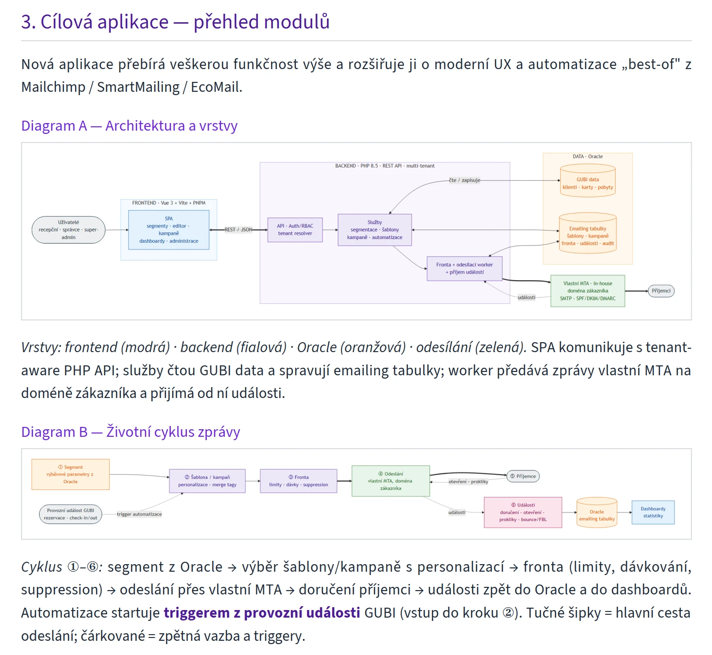

# MD2PDF

> Markdown → profesionálně vysázené PDF. Vlastní řádkový Markdown parser + **dva renderery**: [mPDF](https://mpdf.github.io/) (default, čistě PHP) nebo headless **Chrome + GhostScript** (vektorový mermaid). Titulní strana, obsah, hlavička/patička, callouty, tabulky, auto-fit ASCII diagramů a **render `mermaid` diagramů**. Vše projektově specifické (cesty, výběr souborů, identita, překlad, logo) žije v jednom `md2pdf.config.php` — engine se nemění.

🇨🇿 **Čeština** (níže) · 🇬🇧 [English](#-md2pdf-english)

## Ukázka generovaného PDF



*Ukázka generovaného PDF s Mermaid diagramem*

---

## Co to je

`md2pdf.php` je samostatný PHP nástroj, který převede jeden nebo více Markdown souborů na profesionálně vysázená PDF. Umí **dva režimy**: výchozí **jeden PDF na dokument**, nebo **combine** — sloučení mnoha `.md` do **jednoho** PDF s jednou titulkou a průběžným obsahem (např. vícekapitolový manuál). Je navržený jako **sdílený engine**: nainstaluješ ho jednou (např. do `c:\work\MD2PDF`) a používáš napříč projekty — každý projekt má jen svůj `md2pdf.config.php`.

## Vlastnosti

- **Dva renderery** — `mpdf` (default, čistě PHP, bez závislostí) nebo `chrome` (vektorový mermaid přes headless Chrome + GhostScript); přepíná se v configu, výstup je vizuálně sjednocený.
- **Vlastní Markdown parser** (nadpisy, seznamy vč. vnořených a checkboxů, GFM tabulky se zarovnáním a zalomením buněk, blockquote/callouty, kód, obrázky, HR, **poznámky pod čarou `[^1]`**, odkazy vč. interních kotev a **autolinků `<url>`**, inline `**bold**`/`*italic*`/`~~strike~~`/`code` a **escapování `\*`**).
- **Titulní strana** s brandingem — titul z `# H1`, podtitul/účel a metadata (verze, datum, autor) z úvodního blockquote, logo dole; **full-bleed** pozadí bez hlavičky/patičky.
- **Obsah (TOC)** automaticky z `##` nadpisů (když jsou aspoň 4).
- **Hlavička a patička** + čísla stran v těle (titulka nečíslovaná); texty plně z configu (lokalizace).
- **Callout boxy** z blockquote; „varovné" (oranžové) podle klíčových slov.
- **Mermaid diagramy** — renderer `chrome` vkládá ostré **vektorové SVG**, renderer `mpdf` PNG přes [mermaid-cli](https://github.com/mermaid-js/mermaid-cli).
- **Auto-fit** širokých code-bloků (ASCII diagramy) a tabulek; dlouhé tokeny (DNS/base64) se zalomí.
- **Embedované volné fonty** (Source Sans 3 + Cascadia Mono + DejaVu záloha) → PDF vypadá všude stejně a je legálně přenositelné.
- **Stránkové zlomy** — každá `# H1` i `## H2` kapitola začíná na nové straně (H2 zlom lze vypnout zvlášť přes `h2_page_break`).
- **Combine režim** — sloučení mnoha `.md` do **jednoho** PDF (vícekapitolový manuál): jedna titulka, jeden průběžný obsah (kapitoly H1 + sekce H2), pořadí z `INDEX.md`, cross-chapter `.md` odkazy jako klikací interní kotvy.

## Požadavky

| Nástroj | Verze | K čemu |
|--------|-------|--------|
| PHP | 8.0+ (CLI, s `mbstring`) | běh enginu (oba renderery) |
| Composer | — | instalace mPDF |
| Node.js + npm | 18+ | renderer `chrome` (puppeteer) a/nebo mermaid — **volitelné** |
| Chrome / Edge | jakýkoli Chromium | renderer `chrome` a render mermaidu — **volitelné** |
| GhostScript | — | renderer `chrome` (spojení + optimalizace); jinak volitelně náhledy |

Default renderer `mpdf` běží **jen s PHP + Composer**. Node/Chrome/GhostScript jsou potřeba jen pro renderer `chrome`; bez nich se použije `mpdf` a `mermaid` bloky se vysází jako PNG (mermaid-cli), případně jako kód.

## Renderer

Engine umí **dva renderery** (přepínač `renderer` v configu):

- **`mpdf`** (default) — čistě PHP přes [mPDF](https://mpdf.github.io/), bez Node/Chrome. Menší soubory. Mermaid jako PNG (mermaid-cli, volitelně).
- **`chrome`** — sazba přes headless Chrome + GhostScript: **vektorový mermaid (SVG)**, downsample obrázků. Vyžaduje Node (puppeteer), Chrome/Edge a GhostScript; když Chrome chybí, spadne automaticky zpět na `mpdf`.

Titulní strana je u obou **stejná** (full-bleed pozadí, bez hlavičky/patičky/čísla; běžící hlavička/patička + čísla stran jen v těle). Nastavení chrome rendereru (`chrome.image_dpi`, `chrome.margins`, cesty k `exe`/`gs`) viz [`md2pdf.config.sample.php`](md2pdf.config.sample.php).

## Instalace

```bash
git clone <repo> md2pdf
cd md2pdf
composer install          # mPDF do vendor/
npm install               # mermaid-cli (volitelné, jen pro mermaid)
```

Pro mermaid je potřeba Chromium. Engine **automaticky najde** systémový Chrome/Edge. Pokud žádný nemáš, stáhni puppeteerem:

```bash
npx puppeteer browsers install chrome
```

## Rychlý start

1. Zkopíruj vzor configu do svého projektu a uprav ho:

   ```bash
   cp md2pdf.config.sample.php /cesta/k/projektu/md2pdf.config.php
   ```

   Minimálně nastav `source_dir`, `glob` a identitu (`author`/`company`/`brand`).

2. Spusť převod:

   ```bash
   php /cesta/k/md2pdf/md2pdf.php --config=/cesta/k/projektu/md2pdf.config.php
   ```

   Nebo na Windows přes runner (najde PHP, doinstaluje vendor, umí náhledy):

   ```powershell
   pwsh -File c:\work\MD2PDF\export-pdf.ps1 -Config c:\projekt\md2pdf.config.php -Preview
   ```

   Na Linux/macOS ekvivalentně přes `export-pdf.sh`:

   ```bash
   ./export-pdf.sh --config /cesta/k/projektu/md2pdf.config.php --preview
   ```

PDF vzniknou v `output_dir` (defaultně `{source_dir}/pdf`).

### CLI

```
php md2pdf.php                       # všechny soubory dle 'glob' z configu
php md2pdf.php NazevDokumentu        # jen jeden (basename, .md volitelné)
php md2pdf.php --config=jiny.php     # jiná konfigurace
php md2pdf.php --print-config        # vypíše JSON {source_dir,output_dir,glob}
```

Pořadí hledání configu: `--config=` → env `MD2PDF_CONFIG` → `md2pdf.config.php` vedle skriptu.

## Konfigurace

Config je PHP soubor vracející pole. Plně okomentovaný vzor je [`md2pdf.config.sample.php`](md2pdf.config.sample.php). Nejdůležitější klíče:

| Klíč | Význam |
|------|--------|
| `source_dir` | adresář se zdrojovými `.md` (READ-ONLY) |
| `output_dir` | kam ukládat PDF (`null` = `{source_dir}/pdf`) |
| `glob` | výběr souborů, např. `*.md` nebo `Projekt_*.md` |
| `author` / `company` / `brand` | identita na titulce/v hlavičce/patičce |
| `doc_kind` | typ dokumentu (eyebrow na titulce + patička) |
| `date_format` | formát data (PHP `date()`) |
| `logo` | `['svg'=>…, 'png'=>…]`; `null` = výchozí logo enginu |
| `strings` | všechny zobrazované texty (lokalizace) |
| `source_meta_labels` | labely metabloku v `.md` (`Verze`/`Datum`/`Autor`/`Účel`) |
| `lead_blockquote` | `'meta'` (úvodní blockquote = metadata) / `'keep'` (= obsah) |
| `warn_keywords` | klíčová slova pro „varovný" callout |
| `chapter_page_break` | zlom před každou kapitolou (H1/H2); default `true` |
| `h2_page_break` | zlom před H2 zvlášť; default = `chapter_page_break` |
| `toc_levels` | úrovně nadpisů v obsahu; default `[2, 3]` (combine typicky `[1, 2]`) |
| `combine` | sloučení více `.md` do jednoho PDF (viz [Combine](#combine)) |
| `renderer` | `'mpdf'` (default) nebo `'chrome'` (vektorový mermaid) |
| `chrome` | nastavení chrome rendereru (`exe`, `gs`, `image_dpi`, `margins`) |
| `mermaid` | render mermaidu (viz níže) |

## Konvence Markdownu

- **Titul:** první `# H1` v dokumentu jde na titulní stranu (z těla se vyřízne).
- **Metablok:** úvodní blockquote hned za H1 může nést metadata:

  ```markdown
  # Název dokumentu

  > **Verze:** 1.0 · **Datum:** 1. 1. 2026 · **Autor:** Jan Novák
  > **Účel:** Krátký popis, co dokument řeší.
  ```

  Hodnoty se vytáhnou na titulku. Pokud tvůj úvodní blockquote **není** metadata, ale obsah, nastav v configu `'lead_blockquote' => 'keep'` — zůstane v těle jako úvodní callout.
- **Callouty:** každý blockquote se vykreslí jako box; obsahuje-li `⚠`/`POZOR`/… (dle `warn_keywords`), je oranžový.
- **Obrázky:** `` — relativní cesty se berou vůči `source_dir`.
- **Mermaid:** blok s jazykem `mermaid` → vyrenderovaný diagram (viz níže).

## Combine

Ve výchozím stavu vzniká **jeden PDF na soubor**. Klíč `combine` přepne engine do režimu **více `.md` → jeden PDF** — ideální pro vícekapitolový manuál, kde každý soubor je jedna kapitola.

V combine režimu:

- **Titulní strana** se NEbere z H1 souboru, ale z configu (`combine.title`, `combine.subtitle`, `combine.meta_rows`). H1 každého souboru zůstává v těle jako **nadpis kapitoly**.
- **Pořadí kapitol** řídí volitelný index (`combine.index`, např. `INDEX.md`) — parsuje číslované odkazy `[název](NN_Name.md)` (a `### skupiny`). Soubory mimo index se připojí na konec abecedně. Bez indexu se řadí dle `glob`/abecedy.
- **Obsah (TOC)** je jeden průběžný, typicky kapitoly (H1) + sekce (H2) → nastav `toc_levels => [1, 2]`.
- **Stránkové zlomy** — každá kapitola (H1) začíná na nové straně; sekce (H2) plynou dál → `chapter_page_break => true` + `h2_page_break => false`.
- **Cross-chapter odkazy** — `[text](NN_Name.md)` se přepíše na klikací interní kotvu (na první H1 cílové kapitoly), `[text](NN_Name.md#sekce)` na kotvu dané sekce.

Minimální config:

```php
return [
    'source_dir' => __DIR__ . '/../manual',
    'output_dir' => __DIR__ . '/../manual',
    'glob'       => '[0-9][0-9]*_*.md',   // jen kapitoly; INDEX.md řídí pořadí
    'combine' => [
        'enabled'  => true,
        'output'   => 'manual.pdf',
        'index'    => 'INDEX.md',
        'title'    => 'Název manuálu',
        'subtitle' => 'Krátký podtitul.',
    ],
    'chapter_page_break' => true,
    'h2_page_break'      => false,
    'toc_levels'         => [1, 2],
    'author' => 'Jméno', 'company' => 'Firma', 'brand' => 'Projekt',
];
```

Všechny klíče combine jsou okomentované v [`md2pdf.config.sample.php`](md2pdf.config.sample.php). Mimo combine (klíč chybí / `false`) se engine chová beze změny — jeden PDF na soubor, plně zpětně kompatibilně.

## Mermaid

Bloky `mermaid` se před sazbou vyrenderují do PNG přes `mmdc` a vloží jako obrázek. PNG se cachují podle hashe obsahu (`.mermaid-cache/`), takže nezměněné diagramy se nerenderují znovu.

Engine hledá prohlížeč v pořadí: `mermaid.chrome` v configu → env `MD2PDF_CHROME` → stažený v `.puppeteer/` → systémový Chrome/Edge. Když mmdc nebo prohlížeč chybí, blok zůstane jako kód (graceful fallback).

**Výška diagramu** (renderer `chrome`): diagram se default roztáhne na šířku sloupce; když by tím přesáhl `mermaid.max_height` (default `245mm`), zmenší se proporcionálně tak, aby se vešel na jednu stranu (SVG nelze zlomit přes stránky). Per-diagram strop lze nastavit atributem v info-stringu fence — GitHub a ostatní renderery ho ignorují:

~~~markdown

~~~

Jednotky: `mm`, `cm`, nebo `%` použitelné výšky strany (např. `height=50%` = max polovina strany). Atribut je *maximum* — menší diagram se nezvětšuje.

Konfigurace (sekce `mermaid` v configu): `enabled`, `mmdc`, `chrome`, `theme`, `background`, `scale`, `max_height`.

## Fonty a licence

Všechny embedované fonty jsou **volně licencované** (lze legálně šířit i embedovat do PDF):

- **Source Sans 3** (text) — SIL OFL, [Adobe](https://github.com/adobe-fonts/source-sans)
- **Cascadia Mono** (kód/diagramy) — SIL OFL, [Microsoft](https://github.com/microsoft/cascadia-code)
- **DejaVu Sans/Mono** (záloha pro symboly ✓✗◆★⚠) — bundlováno v mPDF

Kód je pod licencí **MIT** (viz [`LICENSE`](LICENSE)).

## Více projektů

Engine je sdílený; každý projekt má jen `md2pdf.config.php` (a volitelně tenký `export-pdf.ps1` wrapper). Umístění enginu lze přepsat env `MD2PDF_HOME`. Tenký wrapper v projektu:

```powershell
# tools\export-pdf.ps1 v projektu
$Engine = Join-Path ($env:MD2PDF_HOME ?? 'C:\work\MD2PDF') 'export-pdf.ps1'
& $Engine -Config (Join-Path $PSScriptRoot 'md2pdf.config.php') @args
```

## Autor

Radek Hulán — [https://mywebdesign.cz/](https://mywebdesign.cz/)

---

# 🇬🇧 MD2PDF (English)

> Markdown → professionally typeset PDF. Custom line-based Markdown parser + **two renderers**: [mPDF](https://mpdf.github.io/) (default, pure PHP) or headless **Chrome + GhostScript** (vector mermaid). Cover page, table of contents, header/footer, callouts, tables, ASCII-diagram auto-fit and **`mermaid` diagram rendering**. Everything project-specific (paths, file selection, identity, translation, logo) lives in a single `md2pdf.config.php` — the engine never changes.

## What it is

`md2pdf.php` is a standalone PHP tool that converts one or more Markdown files into professionally typeset PDFs. It has **two modes**: the default **one PDF per document**, or **combine** — merging many `.md` files into a **single** PDF with one cover page and a continuous table of contents (e.g. a multi-chapter manual). It is designed as a **shared engine**: install it once (e.g. in `c:\work\MD2PDF`) and reuse it across projects — each project only carries its own `md2pdf.config.php`.

## Features

- **Two renderers** — `mpdf` (default, pure PHP, no deps) or `chrome` (vector mermaid via headless Chrome + GhostScript); switched in the config, visually unified output.
- **Custom Markdown parser** (headings, lists incl. nested & checkboxes, GFM tables with alignment & cell wrapping, blockquotes/callouts, code, images, HR, **footnotes `[^1]`**, links incl. internal anchors and **autolinks `<url>`**, inline `**bold**`/`*italic*`/`~~strike~~`/`code` and **escaping `\*`**).
- **Cover page** with branding — title from `# H1`, subtitle/purpose and metadata (version, date, author) from the leading blockquote, logo at the bottom; **full-bleed** background, no header/footer.
- **Table of contents** auto-generated from `##` headings (when there are at least 4).
- **Header & footer** + page numbers in the body (cover unnumbered); all text comes from the config (localization).
- **Callout boxes** from blockquotes; "warning" (orange) by keyword match.
- **Mermaid diagrams** — the `chrome` renderer embeds crisp **vector SVG**, the `mpdf` renderer PNG via [mermaid-cli](https://github.com/mermaid-js/mermaid-cli).
- **Auto-fit** of wide code blocks (ASCII diagrams) and tables; long tokens (DNS/base64) wrap.
- **Embedded free fonts** (Source Sans 3 + Cascadia Mono + DejaVu fallback) → PDF looks the same everywhere and is legally redistributable.
- **Page breaks** — every `# H1` and `## H2` chapter starts on a new page (the H2 break can be disabled separately via `h2_page_break`).
- **Combine mode** — merge many `.md` files into a **single** PDF (multi-chapter manual): one cover, one continuous TOC (H1 chapters + H2 sections), order from `INDEX.md`, cross-chapter `.md` links as clickable internal anchors.

## Requirements

| Tool | Version | For |
|------|---------|-----|
| PHP | 8.0+ (CLI, with `mbstring`) | running the engine (both renderers) |
| Composer | — | installing mPDF |
| Node.js + npm | 18+ | `chrome` renderer (puppeteer) and/or mermaid — **optional** |
| Chrome / Edge | any Chromium | `chrome` renderer and mermaid rendering — **optional** |
| GhostScript | — | `chrome` renderer (merge + optimize); otherwise optional previews |

The default `mpdf` renderer runs **with PHP + Composer only**. Node/Chrome/GhostScript are needed only for the `chrome` renderer; without them the engine uses `mpdf` and `mermaid` blocks are typeset as PNG (mermaid-cli) or as code.

## Renderer

The engine has **two renderers** (the `renderer` switch in the config):

- **`mpdf`** (default) — pure PHP via [mPDF](https://mpdf.github.io/), no Node/Chrome. Smaller files. Mermaid as PNG (mermaid-cli, optional).
- **`chrome`** — typeset via headless Chrome + GhostScript: **vector mermaid (SVG)**, image downsampling. Requires Node (puppeteer), Chrome/Edge and GhostScript; if Chrome is missing it falls back to `mpdf`.

The cover page is **identical** for both (full-bleed background, no header/footer/page-number; running header/footer + page numbers only in the body). Chrome renderer settings (`chrome.image_dpi`, `chrome.margins`, paths to `exe`/`gs`) — see [`md2pdf.config.sample.php`](md2pdf.config.sample.php).

## Install

```bash
git clone <repo> md2pdf
cd md2pdf
composer install          # mPDF into vendor/
npm install               # mermaid-cli (optional, mermaid only)
```

Mermaid needs a Chromium browser. The engine **auto-detects** a system Chrome/Edge. If you have none, download one via puppeteer:

```bash
npx puppeteer browsers install chrome
```

## Quick start

1. Copy the sample config into your project and edit it:

   ```bash
   cp md2pdf.config.sample.php /path/to/project/md2pdf.config.php
   ```

   At minimum set `source_dir`, `glob` and identity (`author`/`company`/`brand`).

2. Run the conversion:

   ```bash
   php /path/to/md2pdf/md2pdf.php --config=/path/to/project/md2pdf.config.php
   ```

   Or on Windows via the runner (finds PHP, installs vendor, can make previews):

   ```powershell
   pwsh -File c:\work\MD2PDF\export-pdf.ps1 -Config c:\project\md2pdf.config.php -Preview
   ```

   On Linux/macOS, equivalently via `export-pdf.sh`:

   ```bash
   ./export-pdf.sh --config /path/to/project/md2pdf.config.php --preview
   ```

PDFs are written to `output_dir` (defaults to `{source_dir}/pdf`).

### CLI

```
php md2pdf.php                       # all files matching 'glob' from the config
php md2pdf.php DocumentName          # only one (basename, .md optional)
php md2pdf.php --config=other.php    # different configuration
php md2pdf.php --print-config        # prints JSON {source_dir,output_dir,glob}
```

Config lookup order: `--config=` → env `MD2PDF_CONFIG` → `md2pdf.config.php` next to the script.

## Configuration

The config is a PHP file returning an array. A fully commented template is [`md2pdf.config.sample.php`](md2pdf.config.sample.php). Key options:

| Key | Meaning |
|-----|---------|
| `source_dir` | directory with source `.md` files (READ-ONLY) |
| `output_dir` | where to write PDFs (`null` = `{source_dir}/pdf`) |
| `glob` | file selection, e.g. `*.md` or `Project_*.md` |
| `author` / `company` / `brand` | identity on cover/header/footer |
| `doc_kind` | document kind (cover eyebrow + footer) |
| `date_format` | date format (PHP `date()`) |
| `logo` | `['svg'=>…, 'png'=>…]`; `null` = engine's default logo |
| `strings` | all displayed text (localization) |
| `source_meta_labels` | meta-block labels in `.md` (`Verze`/`Datum`/`Autor`/`Účel`) |
| `lead_blockquote` | `'meta'` (leading blockquote = metadata) / `'keep'` (= content) |
| `warn_keywords` | keywords that mark a "warning" callout |
| `chapter_page_break` | page break before each chapter (H1/H2); default `true` |
| `h2_page_break` | page break before H2 separately; default = `chapter_page_break` |
| `toc_levels` | heading levels in the TOC; default `[2, 3]` (combine typically `[1, 2]`) |
| `combine` | merge many `.md` into one PDF (see [Combine](#combine-1)) |
| `renderer` | `'mpdf'` (default) or `'chrome'` (vector mermaid) |
| `chrome` | chrome renderer settings (`exe`, `gs`, `image_dpi`, `margins`) |
| `mermaid` | mermaid rendering (see below) |

## Markdown conventions

- **Title:** the first `# H1` goes onto the cover page (removed from the body).
- **Meta block:** the leading blockquote right after H1 may carry metadata:

  ```markdown
  # Document title

  > **Verze:** 1.0 · **Datum:** 1. 1. 2026 · **Autor:** John Doe
  > **Účel:** A short description of what the document is about.
  ```

  (Labels are configurable via `source_meta_labels`.) If your leading blockquote is **not** metadata but actual content, set `'lead_blockquote' => 'keep'` — it stays in the body as an intro callout.
- **Callouts:** every blockquote renders as a box; if it contains a `warn_keywords` term it turns orange.
- **Images:** `` — relative paths resolve against `source_dir`.
- **Mermaid:** a `mermaid` block → a rendered diagram (see below).

## Combine

By default the engine produces **one PDF per file**. The `combine` key switches it to **many `.md` → a single PDF** — ideal for a multi-chapter manual where each file is one chapter.

In combine mode:

- The **cover page** is NOT taken from a file's H1 but from the config (`combine.title`, `combine.subtitle`, `combine.meta_rows`). Each file's H1 stays in the body as a **chapter heading**.
- **Chapter order** comes from an optional index (`combine.index`, e.g. `INDEX.md`) — it parses numbered links `[title](NN_Name.md)` (and `### groups`). Files not in the index are appended alphabetically. Without an index, files are sorted by `glob`/alphabetically.
- The **TOC** is a single continuous one, typically chapters (H1) + sections (H2) → set `toc_levels => [1, 2]`.
- **Page breaks** — each chapter (H1) starts on a new page; sections (H2) flow on → `chapter_page_break => true` + `h2_page_break => false`.
- **Cross-chapter links** — `[text](NN_Name.md)` is rewritten to a clickable internal anchor (to the target chapter's first H1), `[text](NN_Name.md#section)` to that section's anchor.

Minimal config:

```php
return [
    'source_dir' => __DIR__ . '/../manual',
    'output_dir' => __DIR__ . '/../manual',
    'glob'       => '[0-9][0-9]*_*.md',   // chapters only; INDEX.md drives order
    'combine' => [
        'enabled'  => true,
        'output'   => 'manual.pdf',
        'index'    => 'INDEX.md',
        'title'    => 'Manual title',
        'subtitle' => 'A short subtitle.',
    ],
    'chapter_page_break' => true,
    'h2_page_break'      => false,
    'toc_levels'         => [1, 2],
    'author' => 'Name', 'company' => 'Company', 'brand' => 'Project',
];
```

All combine keys are documented in [`md2pdf.config.sample.php`](md2pdf.config.sample.php). Without `combine` (key absent / `false`) the engine behaves unchanged — one PDF per file, fully backward compatible.

## Mermaid

Fenced `mermaid` blocks are rendered to PNG via `mmdc` before typesetting and embedded as images. PNGs are cached by content hash (`.mermaid-cache/`), so unchanged diagrams aren't re-rendered.

Browser lookup order: `mermaid.chrome` in the config → env `MD2PDF_CHROME` → one downloaded into `.puppeteer/` → system Chrome/Edge. If `mmdc` or a browser is missing, the block stays as code (graceful fallback).

**Diagram height** (`chrome` renderer): a diagram stretches to the column width by default; if that would exceed `mermaid.max_height` (default `245mm`), it is scaled down proportionally to fit on a single page (SVG cannot break across pages). A per-diagram cap can be set via a fence info-string attribute — GitHub and other renderers ignore it:

~~~markdown

~~~

Accepted values: `mm`, `cm`, or `%` of the usable page height (e.g. `height=50%`). The attribute is a *maximum* — smaller diagrams are never enlarged.

Config (the `mermaid` section): `enabled`, `mmdc`, `chrome`, `theme`, `background`, `scale`, `max_height`.

## Fonts & licensing

All embedded fonts are **freely licensed** (legal to redistribute and embed in PDFs):

- **Source Sans 3** (text) — SIL OFL, [Adobe](https://github.com/adobe-fonts/source-sans)
- **Cascadia Mono** (code/diagrams) — SIL OFL, [Microsoft](https://github.com/microsoft/cascadia-code)
- **DejaVu Sans/Mono** (fallback for symbols ✓✗◆★⚠) — bundled with mPDF

The code is licensed under **MIT** (see [`LICENSE`](LICENSE)).

## Multiple projects

The engine is shared; each project only has a `md2pdf.config.php` (and optionally a thin `export-pdf.ps1` wrapper). The engine location can be overridden via the `MD2PDF_HOME` env var. A thin per-project wrapper:

```powershell
# tools\export-pdf.ps1 in the project
$Engine = Join-Path ($env:MD2PDF_HOME ?? 'C:\work\MD2PDF') 'export-pdf.ps1'
& $Engine -Config (Join-Path $PSScriptRoot 'md2pdf.config.php') @args
```

## Author

Radek Hulán — [https://mywebdesign.cz/](https://mywebdesign.cz/)
